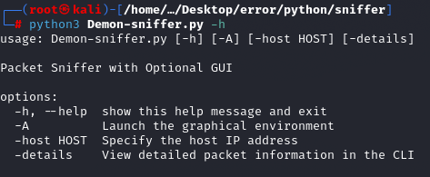
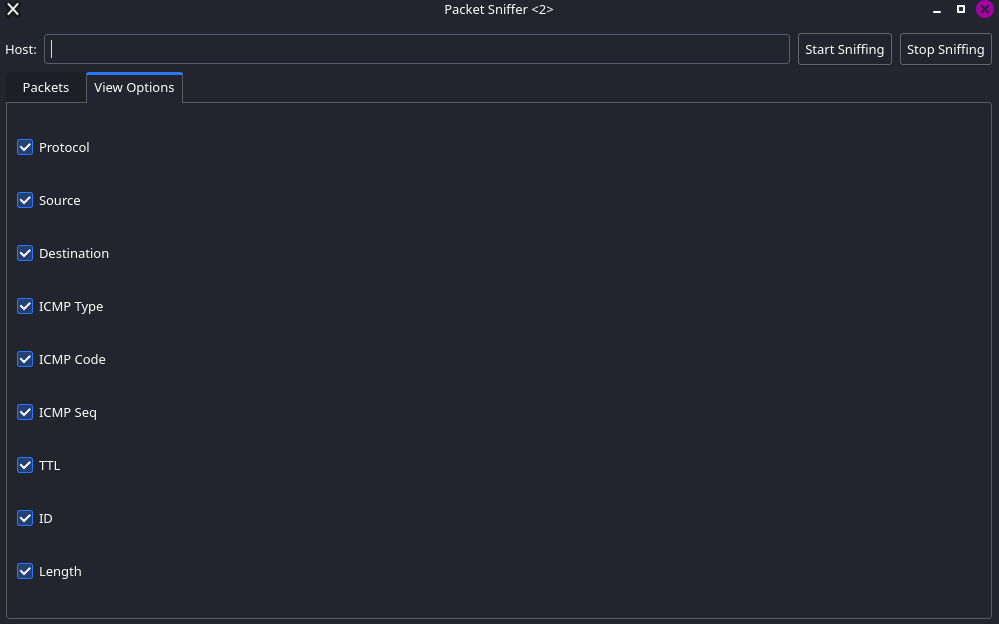

<br/>
<p align="center">
  <a href="https://github.com/errorfiathck">
    
  </a>

  <h3 align="center">Demon Sniffer</h3>

  <p align="center">
    Packet Sniffer application written in Python that provides functionality to capture, analyze, and display network packets in real time.
    <br/>
    Note this project is not done...
    <br/>
    <br/>
    <!-- <a href="https://readme.shaankhan.dev"><strong>View Demo »</strong></a> -->
    <br/>
    <br/>
    <a href="https://intsagram.com/error._.fiat">Our instagram page</a>
    .
    <a href="https://youtube.com/error_fiat">Our youtube chanel</a>
    .
    <a href="https://twitter.com/ErrorFiat">Our twitter page</a>
  </p>
</p>

# Packet Sniffer with Optional GUI and CLI

This project is a Packet Sniffer application written in Python that provides functionality to capture, analyze, and display network packets in real time. The application offers both a Graphical User Interface (GUI) using PyQt5 and a Command Line Interface (CLI) mode for flexible usage. Users can view detailed packet information in either mode and switch between them based on their requirements.



## What is sniffer?
> A sniffer is a software or hardware tool that allows the user to “sniff” or monitor your internet traffic in real time, capturing all the data flowing to and from your computer.

Sniffers work by capturing and inspecting "packets" of data as they travel across a network. Think of internet traffic like real-world traffic: it's like a series of cars driving down a road, and it slows down depending on a variety of factors. On the internet, each car is a packet, and the people inside it are the data it carries.

## GUI Overview

The GUI includes the following components:

1. Host Input: Enter the host IP address for sniffing.
2. Start/Stop Buttons: Control the sniffing process.
3. Packet Table: Displays captured packets with the following columns:
    - Protocol
    - Source IP
    - Destination IP
    - ICMP Type
    - ICMP Code
    - ICMP Sequence
    - TTL
    - Packet ID
    - Packet Length
4. View Options: Toggle the visibility of columns in the packet table.
5. Packet Details: Double-click a packet in the table to open a detailed view, showing:
    - Connection details (protocol, source, destination, etc.).
    - Raw packet data in binary and hexadecimal formats.




## CLI Overview

Basic Mode: Displays a summary of captured packets, including:

1. Protocol
    - Source and Destination IPs
    - ICMP details (if applicable)
    - TTL, Packet ID, and Length

        Example Output:
        ```
        Protocol: ICMP, Source: 192.168.1.10, Destination: 192.168.1.1, ICMP Type: 8, ICMP Code: 0, ICMP Seq: 1, TTL: 64, ID: 54321, Length: 98
        ```

2. Detailed Mode: Displays additional information such as the raw binary and hexadecimal data of packets.

    Example Output:
    ```
    [Packet Captured]
    Protocol: ICMP
    Source: 192.168.1.10
    Destination: 192.168.1.1
    ICMP Type: 8
    ICMP Code: 0
    ICMP Seq: 1
    TTL: 64
    Packet ID: 54321
    Length: 98
    Raw Buffer: 45000054000040004001be5bc0a80101c0a80102e91f0001abcd...
    ```
## How It Works

1. Packet Sniffing:

    - The program uses raw sockets to capture network packets.
    - IP headers and ICMP headers are parsed using struct.unpack() to extract details.
2. GUI Functionality:

    - A QTableWidget is used to display packet details.
    - Clicking a row in the table opens a dialog showing raw data in binary and hex formats.
    - Threading ensures the GUI remains responsive during sniffing.
3. CLI Functionality:

    - Packets are displayed in real time with structured and optionally detailed outputs.

## Installation and Dependencies

Prerequisites:
1. Python 3.6+: Ensure you have Python installed.
2. PyQt5: Required for the GUI. Install it using:
    ```
    pip install PyQt5
    ```

Clone the Repository:
```
git clone https://github.com/errorfiathck/packet-sniffer.git
cd packet-sniffer
```

## Usage
Command-Line Arguments
* -A: Launch the GUI mode for packet sniffing.
* -host [IP]: Specify the host IP address for packet sniffing.
* -details: Display detailed packet information in the CLI.

Examples:

Launch GUI Mode
```
python sniffer.py -A -host 192.168.1.1
```
Basic CLI Mode
```
python sniffer.py -host 192.168.1.1
```
Detailed CLI Mode
```
python sniffer.py -host 192.168.1.1 -cli
```

## Limitations
1. Requires administrative/root privileges to run due to the use of raw sockets.
2. Limited protocol support (ICMP).
3. Packet capture and display may not handle high traffic efficiently.
